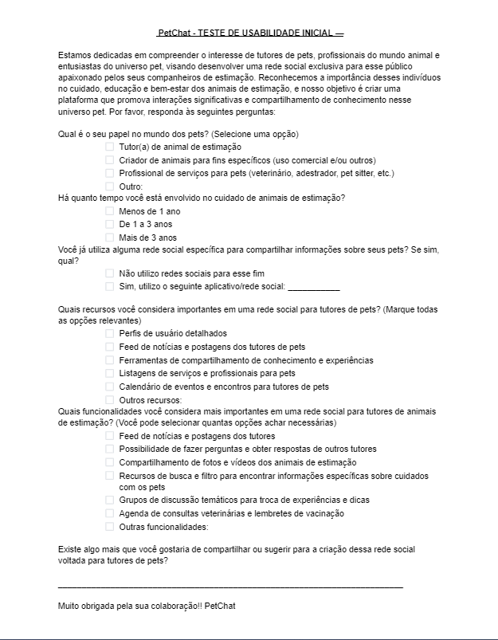
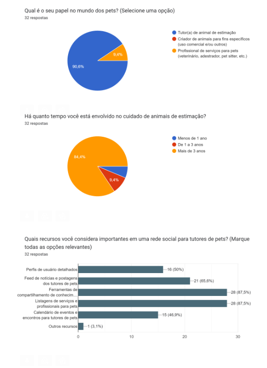
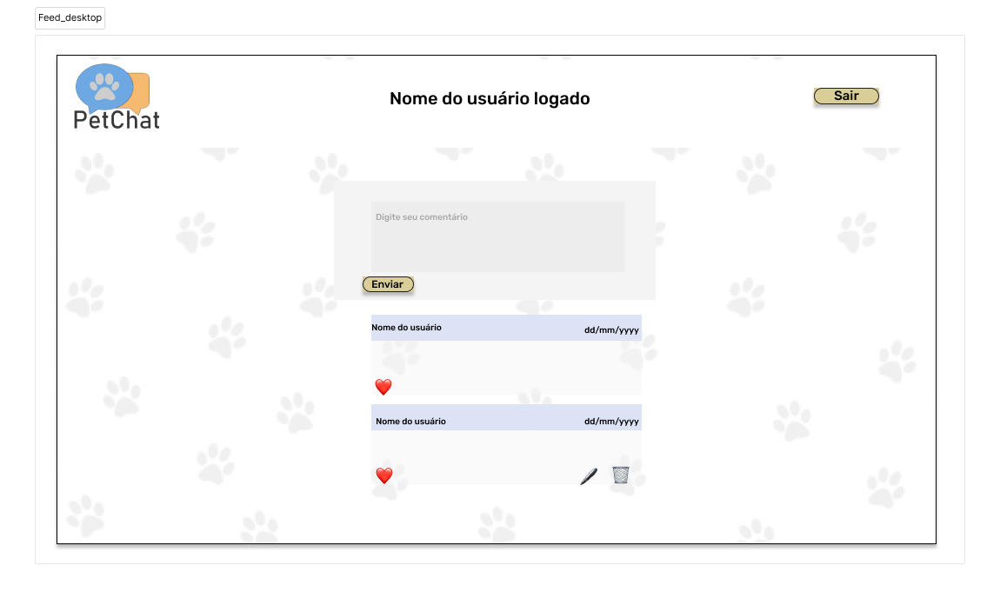
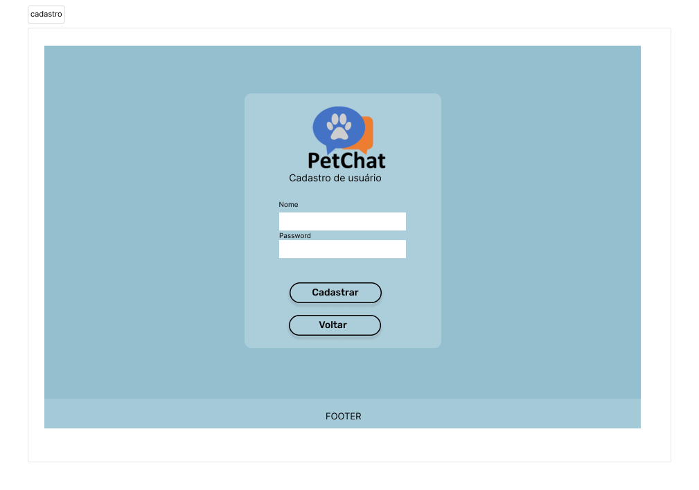

# Social Network - PetChat

## Índice

* [1. Resumo do projeto](#1-resumo-do-projeto)
* [2. Histórias do usuário](#2-histórias-do-usuário)
* [3. Teste de Usabilidade](#3-teste-de-usabilidade)
* [4. Protótipos](#4-protótipos)
* [5. Objetivos de aprendizagem](#5-objetivos-de-aprendizagem)	
* [6. Tecnlógias Utilizadas](#6-Tecnológias-Utilizadas)

***

# 1. Resumo do Projeto

O PetChat é uma ferramenta de chat desenvolvida para conectar tutores de animais de estimação, permitindo que eles compartilhem dúvidas e experiências relacionadas aos seus pets. A plataforma oferece uma comunidade online onde os usuários podem postar comentários, receber curtidas e respostas de outros membros. O objetivo principal é fornecer um espaço interativo e colaborativo para os amantes de animais, permitindo que eles compartilhem conhecimentos, recebam suporte e se conectem uns com os outros. Os tutores podem utilizar o PetChat para fazer perguntas sobre cuidados específicos para seus animais, como alimentação, exercícios, treinamento, saúde e comportamento. Os outros usuários podem curtir as publicações e responder com conselhos, experiências pessoais ou palavras de encorajamento.

* Link do Projeto: [PetChat](https://social-network-1e938.firebaseapp.com/)

### - <strong>Desenvolvido por</strong>:
* Carol Protásio
 [GitHub](https://github.com/carolprotasio) || [Linkedin](https://www.linkedin.com/in/carol-prot%C3%A1sio-8b4a34249/) 

* Caroline Vaz
 [GitHub](https://github.com/carolvaz98) || [Linkedin](https://www.linkedin.com/in/caroline-v-b95019121/) 

* Myllena M. Martins
 [GitHub](https://github.com/myllenammartins) || [Linkedin](https://www.linkedin.com/in/myllenamirandamartins/)

# 2. Histórias do usuário

### <strong>História de Usuário 1: Registro e Gerenciamento de Conta</strong>

> Como usuário, desejo criar uma conta de acesso, fazer login, criar, editar, deletar e dar likes em publicações.

- Critérios de Aceitação:
* O usuário pode se registrar usando seu email, senha e preenchendo um apelido ou nome de usuário.
* Se o email fornecido for inválido, o usuário receberá um alerta informando para inserir um email válido.
* O usuário pode optar por fazer login rapidamente usando a opção "Entrar com o Google".
* O acesso ao feed de publicações só é permitido após o registro completo do usuário.
* O registro deve ser fácil de realizar em qualquer dispositivo, mantendo a interface do aplicativo.

### <strong>História de Usuário 2: Funcionalidades da Rede Social</strong>

> Eu, como usuário registrado, quero poder fazer publicações, compartilhar informações úteis sobre animais de estimação.

- Critérios de Aceitação:
* O usuário registrado pode fazer publicações para compartilhar com a comunidade na página do feed.
* Os usuários podem visualizar as publicações de outros usuários no feed da PetChat.
* Os usuários podem curtir as publicações de outros usuários.
* Os usuários podem comentar nas publicações de outros usuários.
* O sistema exibe informações úteis sobre cuidados com animais de estimação, incluindo artigos e dicas relevantes.

### <strong>História de Usuário 3: Compartilhando Experiências e Informações.</strong>

> Eu, como usuário já registrado, quero poder compartilhar minha experiência, criar posts com informações sobre veterinários recomendados, histórias de adoção de animais ou dicas de cuidados para compartilhar com outros usuários.

-Critérios de Aceitação:

* Os usuários podem criar posts contendo informações sobre veterinários recomendados, histórias de adoção de animais ou dicas de cuidados para compartilhar com a comunidade.
* Os usuários podem criar posts contendo informações sobre veterinários recomendados, histórias de adoção de animais ou dicas 
* Outros usuários podem visualizar e interagir com os posts curtindo
* Os posts podem incluir texto relevante e detalhado.

# 3. Teste de usabilidade
Realizamos teste de usabilidade, através do Google forms, para avaliar a experiência do usuário em nosso projeto. O objetivo desse teste foi identificar possíveis problemas de usabilidade, obter feedback dos usuários e realizar melhorias com base nessas informações.
  

# 4. Protótipos
## Protótipo de alta fidelidade - Desktop
- Home:

- Registro:

- Feed:

## Protótipo de alta fidelidade - Mobile

## Protótipo de baixa fidelidade Desktop
- Home:

- Registro:

- Feed: 

# 5. Objetivos de aprendizagem

<ul>
  <li>Uso de HTML semântico</li> 
  <li>Uso de seletores de CSS</li> 
  <li>Modelo de caixa (box model): borda, margem, preenchimento</li>  
  <li>Uso de flexbox e grid em CSS</li> 
  <li>Uso de seletores de DOM</li> 
  <li>Manipulação de eventos de DOM (listeners, propagação, delegação)</li> 
  <li>Arrays (arranjos)</li> 
  <li>Objetos (key, value)</li> 
  <li>Variáveis (declaração, atribuição, escopo)</li> 
  <li>Promessas</li> 
  <li>Diferenciar entre tipos de dados primitivos e não primitivos</li> 
  <li>Uso de condicionais (if-else, switch, operador ternário, lógica booleana)</li> 
  <li>Funções (params, args, return)</li>
  <li>Single Page Application (SPA)</li>  
  <li>Testes unitários (unit tests)</li>
  <li>Testes assíncronos</li>
  <li>Uso de mocks e espiões</li> 
  <li>Firebase Auth</li> 
  <li>Firestore</li> 
</ul>

# 5. Tecnológias Utilizadas

  
 

 

 

 
 
